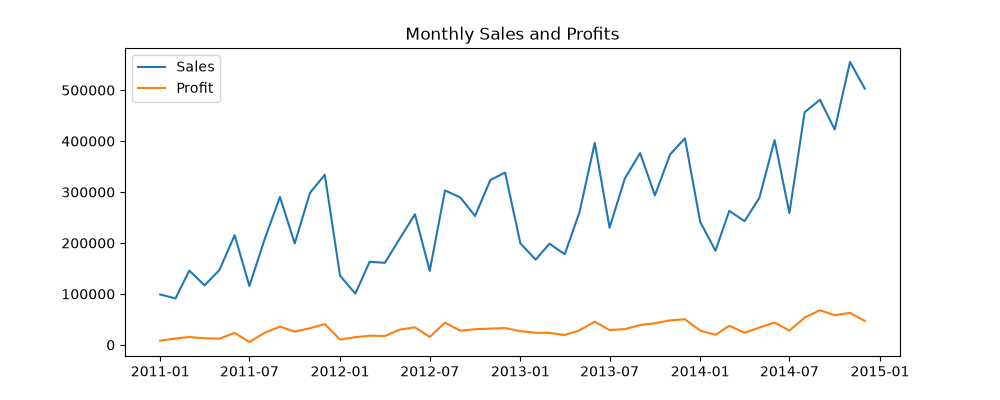
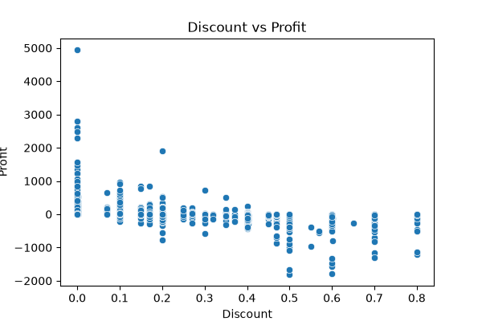

# AI Business Operations Agent

This is my project on Sales/CRM and customer operations. It forecasts the profit of each product category and also answers policy questions (shipping, returns, discounts) using a chatbot. The agent combines both: if profit is going down, it shows the related policy.

Live app: [(https://ai-business-operations-agent-xwhoqewylvwt8tbtev2kdu.streamlit.app/)]

## What this project does
1. **Forecasting** - predicts next month profit for Furniture, Office Supplies and Technology.
2. **RAG chatbot** - answers questions from 6 company policy PDFs.
3. **Agent** - if predicted profit drops by more than 5%, it recommends checking the discount policy and shows the policy text.
4. **Streamlit app** - simple UI to use all of the above.

## Dataset
Global Superstore dataset (51,290 orders, 2011 to 2014) with sales, profit, discount, shipping cost, ship mode, segment, market, etc.

Cleaning done:
- fixed date columns
- filled missing Postal Code with 0
- added Shipping_Days, Order_Year, Order_Month, Order_Quarter
- removed Row ID and Customer Name

## Tech stack
Python, Pandas, NumPy, Matplotlib, Seaborn, Scikit-learn, XGBoost, LangChain, FAISS, HuggingFace embeddings (all-MiniLM-L6-v2), Streamlit

## Project steps
| Step | File | What I did |
|---|---|---|
| 1 | clean.py | data cleaning |
| 2 | EDA.py | 5 charts (trend, category, sub-category, discount, shipping) |
| 3 | Feature ER.py | monthly data per category, lag features (last 3 months), one hot encoding |
| 4 | forecasting model.py | trained 3 models, saved the best |
| 5 | RAG.py | loaded PDFs, split into 500 character chunks, embeddings, FAISS index |
| 6 | agent.py | forecast function + policy search + recommendation |
| 7 | app.py | Streamlit app |

## Model results
Train/test split was done by date (first 80% months train, last 20% test), not random, because it is time data.

| Model | RMSE | MAE | R2 |
|---|---|---|---|
| Linear Regression | [6592.27] | [5148.0] | [0.322] |
| Random Forest | [5982.13] | [ 4550.66] | [ 0.442] |
| XGBoost | [6196.76] | [ 4571.03] | [ 0.401] |

Random Forest gave the best result so I used it. R2 is not very high because there are only 135 monthly rows (3 categories x 45 months).

## Key findings from EDA
- High discount orders usually give negative profit.
- [add 2 or 3 points from your own charts, example: which category has the most profit]

## RAG chatbot
Policy PDFs used: return and refund, shipping and delivery, discount and pricing, customer segment service, regional market, customer support escalation.

Currently the chatbot returns the most relevant policy text for the question (no OpenAI key used). It can be upgraded with an LLM later to give full sentence answers.

Sample questions tested:
- What is the refund policy for furniture?
- Why might my order be delayed?
- What approval is needed for a 40% discount?
- When is an order escalated to Tier 2?
- Is Same Day shipping available in Africa?

## How to run
```
pip install -r requirements.txt
py -m streamlit run app.py
```

Folder structure:
```
app.py
agent.py
model.pkl
feature_cols.pkl
monthly_feature.csv
faiss_index/
rag_docs/
requirements.txt
```

## Limitations and future work
- Only 135 monthly rows, so forecast accuracy is limited.
- Forecast is for one month ahead only.
- Add an LLM (OpenAI) for better chatbot answers.
- Add forecasting by region and market also.

## Screenshots


